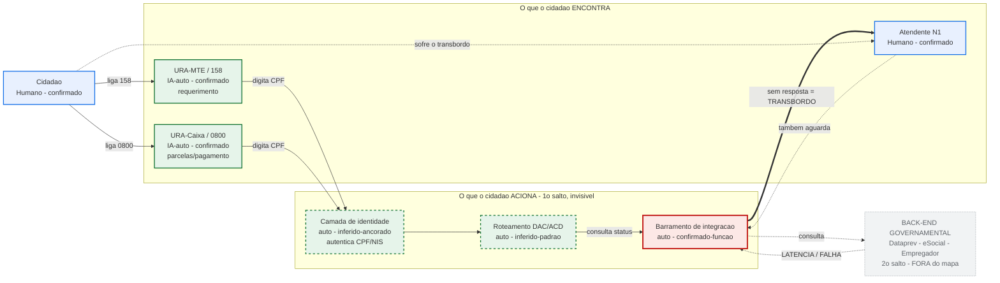
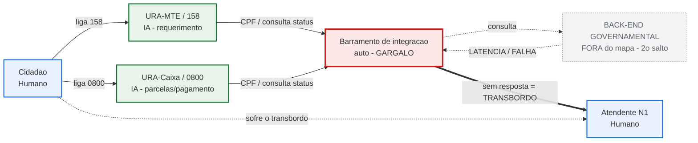

# C — Mapa de Atores: Jornada Telefônica do Seguro-Desemprego (MTE + Caixa)

> **Recorte:** canal telefônico + regra do **primeiro salto** (entra quem o cidadão *encontra* ou *aciona diretamente*; o que o primeiro salto aciona por sua vez vira caixa-preta).
> **Premissa corrigida:** não é "uma URA da Caixa" — são **duas URAs** (158/MTE para requerimento; 0800/Caixa para parcelas/pagamento), percebidas como **jornada única do ponto de vista do cidadão**.
> **Gargalo:** ancorado no **barramento de integração** (a borda que transborda quando o back-end atrasa); cidadão e atendente são quem *sofre* o transbordo, não a causa.
> Base: `B_relatorio_assistente1.md`, `B_relatorio_assistente2.md`, `B_sintese_adversarial.md` (v1+v2) e sessão `B_grill_me_sessao.md`.

---

## Diagrama (Mermaid)

---

## Legenda

- **Borda azul** = ator **humano** · **borda verde** = ator **IA/automatizado**.
- **Borda tracejada** = ator **inferido** (sem documentação direta) · borda sólida = **confirmado**.
- **Caixa vermelha** = **gargalo** (barramento).
- **Caixa cinza tracejada** = **fora do mapa** (segundo salto / caixa-preta).
- **Seta grossa (==>)** = transbordo · **seta pontilhada (-.->)** = dependência/latência atrás da borda.

---

## Tabela de atores (carimbo dos três testes)

| # | Ator | Natureza | O cidadão... | Existência |
|---|------|----------|--------------|------------|
| 1 | Cidadão | Humano | é o eixo | Confirmado |
| 2 | URA-MTE / 158 | IA/auto | **encontra** | Confirmado (automação) |
| 3 | URA-Caixa / 0800 | IA/auto | **encontra** | Confirmado (automação) |
| 4 | Atendente N1 | Humano | **encontra** (transbordo) | Confirmado |
| 5 | Roteamento DAC/ACD | Automatizado | **aciona** (1º salto, invisível) | Inferido-padrão |
| 6 | Camada de identidade | Automatizado | **aciona** (1º salto, autentica CPF) | Inferido-ancorado |
| 7 | Barramento de integração | Automatizado | **aciona** (1º salto, consulta status) | Confirmado-função |
| — | Back-end governamental (Dataprev/eSocial/Empregador) | Caixa-preta | nunca toca | **Fora** — 2º salto |

---

## Relação que importa (espinha dorsal do mapa)

`URA (2/3) → identidade (6) → roteador (5) → barramento (7) → [borda] → back-end`

Quando o **back-end** (fora do mapa) apresenta **latência/falha**, o **barramento (7)** fica sem resposta e **transborda** a chamada para o **atendente (4)**. Logo:

- O **gargalo** é propriedade do **barramento**, não do atendente.
- **Cidadão (1)** e **atendente (4)** estão **do mesmo lado** da falha — ambos aguardam o mesmo sistema atrás da borda.
- A **causa-raiz é externa** ao mapa; o diagrama mostra o **sintoma** (transbordo) e aponta a origem com seta pontilhada vinda da caixa-preta. Isso sustenta recomendação de mecanismo, não de sintoma ("contratar mais atendentes" trataria só o sintoma).

---

## Dúvidas residuais (follow-up / LAI — para a v3)

1. **URAs (2/3) usam NLP/ASR ou são DTMF puro?** Permanece *inferido-padrão*; só LAI à Caixa/Serpro/Dataprev resolve.
2. **Roteador (5) e identidade (6) são atores ou funções da URA?** Teste 3 em aberto — podem colapsar dentro de 2/3 sem perda (ver variante enxuta abaixo).
3. **O dado da CGU (18,6% online) inclui recurso por telefone/URA?** Define se é evidência sobre a URA ou apenas analogia sobre autosserviço. Pergunta de LAI.

---

## Variante enxuta (opcional — atores 5 e 6 tratados como função, não ator)

